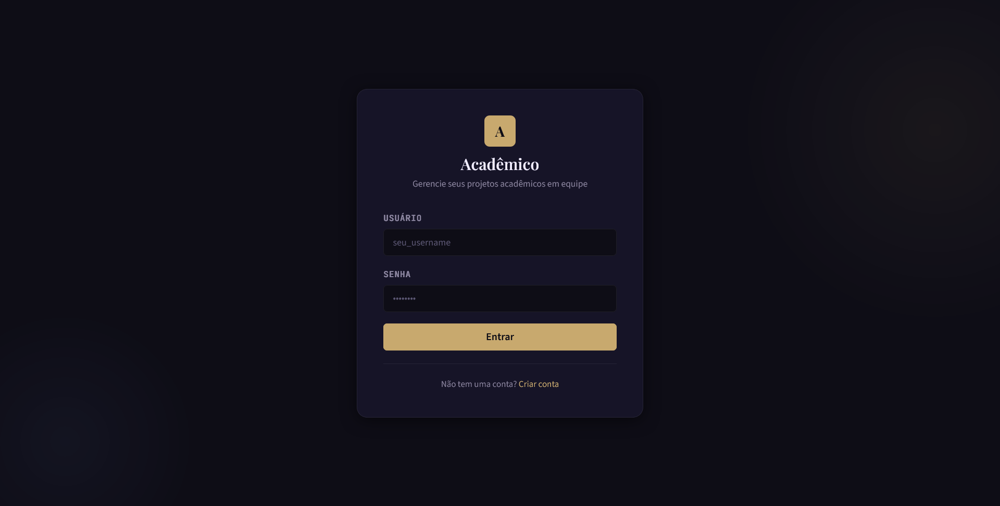
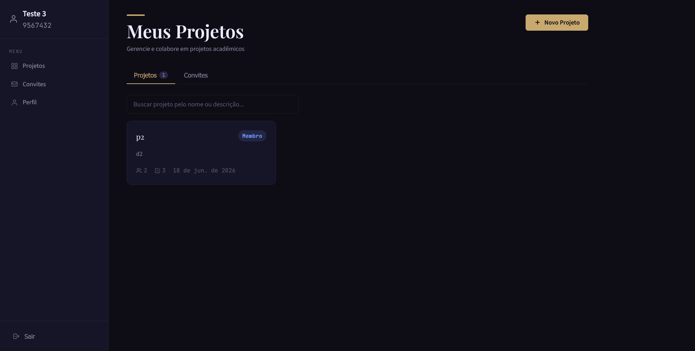
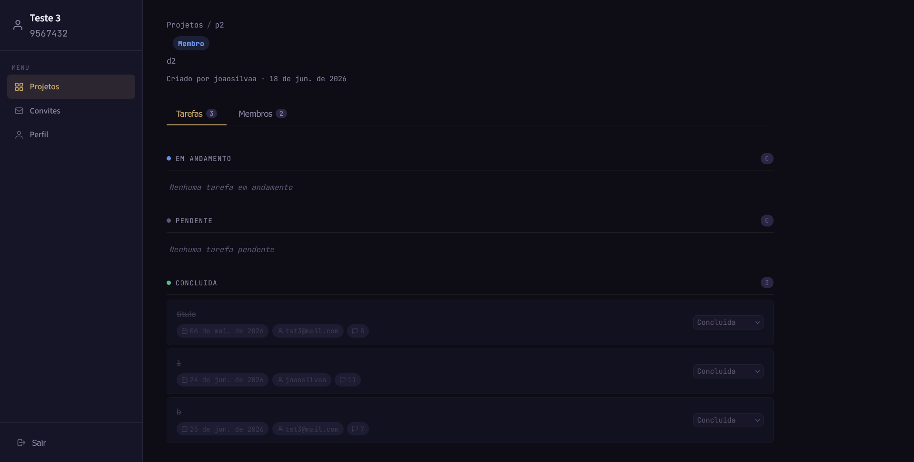

# Acadêmico — Frontend

**Autor:** Rafael Gama Vergilio

---

## Índice

- [Descrição do Projeto](#descrição-do-projeto)
- [Instalação e Uso Local](#instalação-e-uso-local)
- [Compilar o TypeScript](#compilar-o-typescript)
- [Telas da Aplicação](#telas-da-aplicação)
- [Manual do Usuário](#manual-do-usuário)
- [O que funcionou](#o-que-funcionou)
- [O que não funcionou](#o-que-não-funcionou)

---

## Descrição do Projeto

**Acadêmico** é um site estático para criação e gestão de projetos acadêmicos em equipe. Os usuários criam projetos, convidam colegas, distribuem tarefas e acompanham o progresso com comentários atualizados automaticamente via polling.

O frontend é composto por páginas HTML, CSS e JavaScript que se comunicam com a [API backend](../backend_clean) via chamadas HTTP. Todo o código JavaScript foi escrito em TypeScript e compilado antes da publicação.

### Tecnologias utilizadas

| Tecnologia | Finalidade |
|---|---|
| HTML5 | Estrutura das páginas |
| CSS3 | Estilização e design system próprio |
| TypeScript | Lógica do frontend (compilado para JS) |
| Fetch API | Comunicação com a API backend |
| JWT via localStorage | Autenticação persistente entre páginas |

### Páginas implementadas

| Arquivo | Página | Descrição |
|---|---|---|
| `index.html` | Login | Autenticação do usuário |
| `register.html` | Cadastro | Criação de nova conta |
| `dashboard.html` | Dashboard | Lista de projetos e convites pendentes |
| `project.html` | Projeto | Detalhes, membros, convites e tarefas |
| `task.html` | Tarefa | Detalhes, status, responsável e observações |
| `profile.html` | Perfil | Edição de dados e troca de senha |

### Escopo implementado

- Login: autenticação com username e senha; tokens JWT armazenados em `localStorage`.
- Cadastro: criação de conta com nome, sobrenome, matrícula, e-mail e senha.
- Dashboard: listagem e busca de projetos do usuário; aba de convites pendentes.
- Página de Projeto: detalhes do projeto, membros, envio de convites e lista de tarefas com filtros.
- Página de Tarefa: detalhes, alteração de status, atribuição de responsável e observações com polling a cada 6 segundos.
- Perfil: edição de nome, sobrenome e matrícula; troca de senha com validação da senha atual.
- Sidebar dinâmica: exibe nome do usuário, badge de convites pendentes e navegação entre páginas.
- Controle de papéis: a interface mostra ou oculta ações conforme o papel do usuário no projeto (Líder ou Membro).

---

## Instalação e Uso Local

### Pré-requisitos

- A [API backend](../backend_clean) rodando em `http://localhost:8000`
- Qualquer servidor HTTP estático (opção A ou B abaixo)

### Opção A: Python (sem instalação extra)

```bash
cd frontend
python -m http.server 5173
```

Acesse **http://localhost:5173**.

### Opção B: npx serve

```bash
cd frontend
npx serve .
```

Abrir o `index.html` diretamente como arquivo (`file://`) causa erros de CORS. Sempre use um servidor HTTP.

---

## Compilar o TypeScript

O código-fonte TypeScript está em `src/`. Os arquivos JavaScript compilados em `js/` já estão incluídos no repositório e prontos para uso — não é necessário recompilar para rodar o site.

Para recompilar após alterações nos arquivos `.ts`:

```bash
cd frontend
npm install          # instala o TypeScript declarado em package.json
npx tsc              # compila seguindo o tsconfig.json
```

Os arquivos gerados em `js/` sobrescrevem os anteriores automaticamente.

### Estrutura dos arquivos TypeScript

| Fonte (`src/`) | Compilado (`js/`) | Responsabilidade |
|---|---|---|
| `api.ts` | `api.js` | Funções de comunicação com a API e refresh de token |
| `auth.ts` | `auth.js` | Guarda de rota e informações do usuário logado |
| `login.ts` | `login.js` | Lógica do formulário de login |
| `register.ts` | `register.js` | Lógica do formulário de cadastro |
| `dashboard.ts` | `dashboard.js` | Listagem de projetos, busca e convites |
| `project.ts` | `project.js` | Membros, convites, tarefas e filtros do projeto |
| `task.ts` | `task.js` | Detalhes da tarefa, status e observações com polling |
| `profile.ts` | `profile.js` | Edição de perfil e troca de senha |

---

## Telas da Aplicação







---

## Manual do Usuário

### Criar uma conta

1. Na página inicial, clique em **Criar conta**.
2. Preencha nome, sobrenome, username, e-mail institucional, matrícula e senha.
3. Clique em **Criar conta**. Você será redirecionado ao Dashboard.

### Fazer login

Informe seu **username** e **senha** na página inicial e clique em **Entrar**.

### Criar um projeto

1. No Dashboard, clique em **Novo Projeto**.
2. Preencha nome e descrição e clique em **Criar**.
3. Você vira o **Líder** do projeto automaticamente.

### Convidar um colega

1. Abra o projeto desejado.
2. Na seção **Membros**, clique em **Convidar**.
3. Informe o **username** do colega e confirme.
4. O colega verá o convite na aba **Convites** do Dashboard.

### Aceitar ou recusar um convite

Na aba **Convites** do Dashboard, clique em **Aceitar** ou **Recusar** no convite desejado.

### Criar e gerenciar tarefas (Líder)

1. Dentro do projeto, clique em **Nova Tarefa**.
2. Preencha título, descrição, responsável (opcional) e prazo (opcional) e clique em **Criar**.
3. Para editar ou excluir, abra a tarefa e use os botões correspondentes.

### Atualizar o status de uma tarefa (qualquer membro)

Abra a tarefa e altere o campo **Status** para *Pendente*, *Em andamento* ou *Concluída*. Uma observação automática registra quem fez a mudança e quando.

### Deixar uma observação (qualquer membro)

Na página da tarefa, escreva na caixa de texto e clique em **Enviar**. As observações são atualizadas automaticamente a cada 6 segundos via polling.

### Trocar a senha

1. Acesse **Perfil** pela sidebar lateral.
2. Clique em **Alterar senha**.
3. Informe a senha atual, a nova senha e a confirmação e salve.

### Controle de papéis na interface

| Elemento | Visível para |
|---|---|
| Botão "Nova Tarefa" | Líder |
| Botões editar / excluir tarefa | Líder |
| Botão "Convidar" membro | Líder |
| Botão remover membro | Líder |
| Alterar status da tarefa | Todos os membros |
| Enviar observação | Todos os membros |

---

## O que funcionou

Login e cadastro com validação de campos. Renovação automática do token de acesso ao expirar, com redirecionamento para o login quando o refresh também expira.

Dashboard com listagem e busca de projetos, criação de projetos e aba de convites com badge de pendentes na sidebar.

Envio, aceitação e recusa de convites. Página de projeto com membros, lista de tarefas filtráveis e criação/edição/exclusão de tarefas pelo Líder.

Mudança de status de tarefas por qualquer membro. Observações com polling automático a cada 6 segundos. Controle de papéis: botões e ações visíveis conforme o papel no projeto.

Perfil com edição de dados e troca de senha. CSS responsivo com design system próprio. Todo o JavaScript foi desenvolvido em TypeScript.

---

## O que não funcionou

**Esqueci minha senha:** a recuperação de senha via e-mail não foi implementada. Usuários que não lembram a senha não conseguem redefini-la pelo site. A troca de senha para usuários logados está disponível e funcionando normalmente na página de Perfil.

---

**Link do site:**